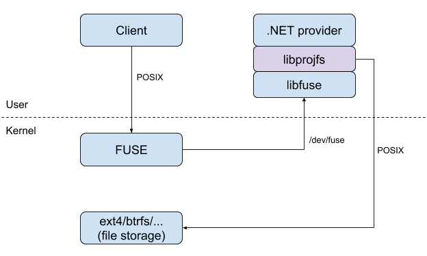

# libprojfs

A Linux projected filesystem library, similar in concept to the Windows
[Projected File System][winprojfs] and developed in conjunction with the
[VFSForGit][vfs4git] project.

The libprojfs C library may also be used independently of VFSForGit.

## Current Status

The library is under active development and supports basic
directory projection, with additional features being added regularly.

We will only make a first, official versioned release once initial
development is complete.

A libprojfs filesystem can currently be used to mount a VFSForGit
[`MirrorProvider`][mirror] test client; we expect to continue
initial pre-release development until the actual VFSForGit client
is also functional with libprojfs.

## Design

The libprojfs library is designed to function as a stackable Linux
filesystem supporting a "provider" process which implements custom
callbacks to populate files and directories on demand.  This is
illustrated in the context of a VFSForGit provider below:

Actual file storage is delegated to a "lower" storage filesystem,
which may be any Linux filesystem, e.g., ext4.  At the time of
when a libprojfs filesystem mount is created, there may be no
files or directories in the lower filesystem yet.

As normal filesystem requests are made within the libprojfs mount
(e.g., by `ls` or `cat`), libprojfs intercepts the requests
and queries the provider process for the actual contents of the
file or directory.  The provider's response is then written to
the lower filesystem so future accesses may be satisfied without
querying the provider again.

See our [design document](docs/design.md#vfsforgit-on-linux) for
more details.

## Getting Started

*TBD*

## Contributing

Thank you for your interest in libprojfs!

We welcome contributions; please see our [CONTRIBUTING](CONTRIBUTING.md)
guidelines and our contributor [CODE_OF_CONDUCT](CODE_OF_CONDUCT.md).

## Licensing

The libprojfs library is licensed under the [LGPL v2.1](COPYING).

See the [NOTICE](NOTICE) file for a list of other licenses used in the
project, and in the comments in each file for the licenses applicable to them.

## Development Roadmap

We are developing the libprojfs library first, using FUSE to prototype and
test its performance, before migrating functionality into a Linux kernel
module (assuming that proves to be necessary to meet our performance
criteria).  For more details on the planned development phases, see the
[design document](docs/design.md#development-process).

The VFSForGit API, which is currently supported through the use of
the `--enable-vfs-api` configuration option to libprojfs, may at some
point refactored out of this library entirely and handled exclusively
within Linux-specific code in the VFSForGit project.  However, for
the moment it has proven efficient to keep it within this library
while libprojfs undergoes rapid early development.

## Authors

The libprojfs library is currently maintained and developed by
several members of GitHub's Engineering organization, including:

* [@chrisd8088](https://github.com/chrisd8088)
* [@kivikakk](https://github.com/kivikakk)

You can also contact the GitHub project team at
[opensource+libprojfs@github.com](mailto:opensource+libprojfs@github.com).

[gnu-build]: https://www.gnu.org/software/automake/manual/html_node/GNU-Build-System.html
[gpl-v2]: https://www.gnu.org/licenses/old-licenses/gpl-2.0.en.html
[lgpl-v2]: https://www.gnu.org/licenses/old-licenses/lgpl-2.1.en.html
[mirror]: https://github.com/github/VFSForGit/tree/features/linuxprototype/MirrorProvider
[mit]: https://github.com/Microsoft/VFSForGit/blob/master/License.md
[winprojfs]: https://docs.microsoft.com/en-us/windows/desktop/api/_projfs/
[vfs4git]: https://github.com/Microsoft/VFSForGit

